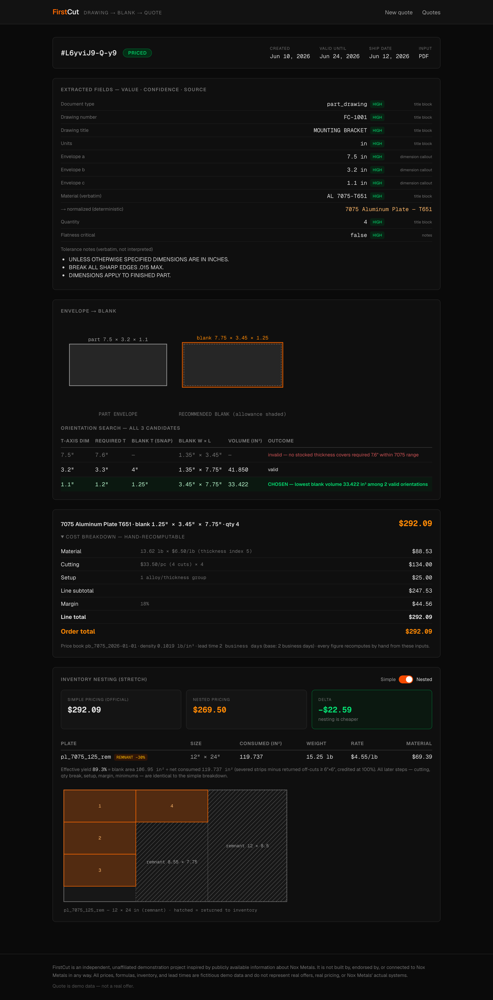
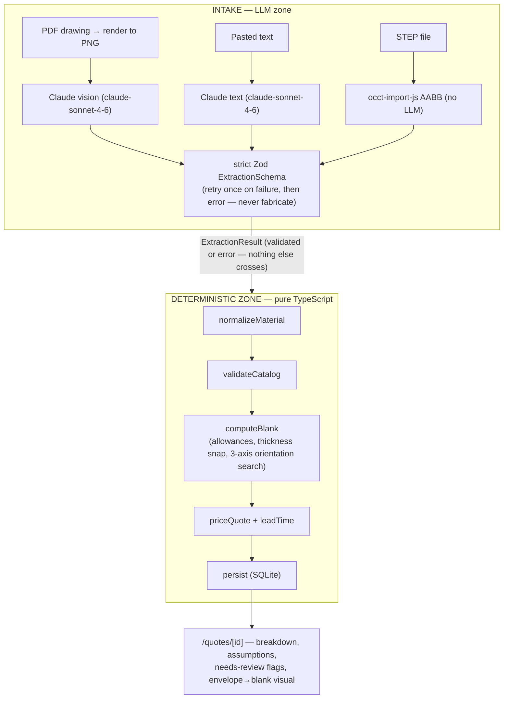

# FirstCut — part drawing → stock blank → itemized quote

> **Disclaimer.** FirstCut is an independent, unaffiliated demonstration project inspired by publicly available information about Nox Metals. It is not built by, endorsed by, or connected to Nox Metals in any way. All prices, formulas, inventory, and lead times are fictitious demo data and do not represent real offers, real pricing, or Nox Metals' actual systems.

Upload a part drawing (PDF), a STEP file, or a pasted spec. Claude **extracts** the part envelope and material spec; deterministic TypeScript **converts** the envelope to a recommended stock blank, **validates** it against a catalog, and **prices** it with a fully itemized, hand-recomputable breakdown. Every uncertainty surfaces as an explicit assumption (amber) or needs-review flag (red) — never a silent guess.

<p align="center"></p>

## Architecture: the extract / price split

**The LLM never prices anything and never decides validity. It only extracts.**



An LLM-in-the-loop price is unauditable; an LLM-at-the-edge extractor feeding a deterministic engine is auditable line by line. Every field the extractor emits carries a **confidence** and a **source** (title block, dimension callout, geometry, …), `inferred` can never be `high` confidence (enforced in the schema), and LLM output that fails validation is retried exactly once with the error appended — a second failure produces an error state, never a number.

## Quickstart

```bash
npm i && npm run seed && npm run dev
```

`npm run seed` creates the SQLite DB (`data/firstcut.db`), seeds the catalog/price book, and generates all fixtures (PDF drawings, STEP block, text specs) into `/fixtures`. One-click fixture chips on the intake page run each pipeline path.

| Env var | Required | Purpose |
|---|---|---|
| `ANTHROPIC_API_KEY` | For PDF/text intake and `npm run e2e:live` | Claude extraction calls. The STEP path, all Vitest suites, and the UI on persisted quotes work without it. |

Other commands: `npm test` (151 deterministic Vitest cases; the LLM is always mocked) · `npm run e2e` (Playwright browser suite: intake → fixture chip → quote page → nest toggle → persistence; reseeds, builds, and starts its own production server on :3344 — the live fixture-A test auto-skips without an API key) · `npm run e2e:live` (manual live-API end-to-end: every fixture through real extraction, asserted against expected outcomes).

## Recompute a quote by hand

Text fixture T1 — `7075-T651, finished part 7.5 x 3.2 x 1.1, qty 4`, DFARS off, default allowances (0.125"/side, 0.1" thickness cleanup):

**Blank (rules layer):** thickness axis 1.1 → required 1.2 → snaps up to stocked **1.25"** (alternatives: t-axis 3.2 → 3.3 → snap 4.0 gives 41.85 in³; t-axis 7.5 → 7.6 → snap 8.0 exceeds 7075's 6.0" max → invalid). Plan: 7.5→7.75, 3.2→3.45. **Chosen blank: 1.25 × 3.45 × 7.75 in, volume 33.421875 in³.**

| step | computation | value |
|---|---|---|
| weight | 33.421875 × 0.1019 × 4 = 13.62276 → round | **13.62 lb** |
| rate | 6.40 + 0.02 × thicknessIndex(1.25 = 5) | **$6.50/lb** |
| material | 13.62 × 6.50 | **$88.53** |
| DFARS | off | $0.00 |
| cutting/pc | 4 × (4.00 + 3.50 × 1.25) = 4 × 8.375 | **$33.50** |
| cutting | 33.50 × 4 | **$134.00** |
| qty break | qty 4 < 5 | $0.00 |
| setup | 1 group | **$25.00** |
| line subtotal | 88.53 + 134.00 + 25.00 | **$247.53** |
| margin 18% | 247.53 × 0.18 = 44.5554 → round | **$44.56** |
| **line total** | | **$292.09** |
| order minimum | 292.09 ≥ 120 | no adjustment |
| **order total** | | **$292.09** |

Lead time: blank 1.25" ≤ 4", qty 4 ≤ 10, no DFARS → **2 business days** (weekends skipped). Validity 14 days. This exact table is asserted to the cent in `src/pricing/__tests__/price.test.ts`, and a 200-case property test checks that every randomized breakdown recomputes from its own displayed inputs.

## Stretch: inventory-aware nesting

Priced quotes also nest against a seeded plate inventory (shelf-based first-fit guillotine, remnants preferred, 90° rotation allowed). The quote page gains a **Simple vs Nested** toggle: side-by-side totals, the delta, per-plate material lines, effective yield %, and an SVG of the nest with returned off-cuts hatched. Off-cuts ≥ 6"×6" go back into inventory as remnant rows; consumed plates flip to `consumed` (reseed restores the demo inventory). Remnant-sourced material is charged at 70% of the book rate — a documented deviation, because under the spec's literal cost model (yield ≤ 100% by construction) nesting could never beat simple pricing. The official quote total is always the simple, byte-identical v1 breakdown; nesting is informational.

## What's dummy vs grounded

| | |
|---|---|
| **Grounded in Nox's public materials page** | Alloy list (6061/7075/7050/5052/5083/5086/cast tool & jig; Inconel/stainless as by-request), stocked tempers, thickness ranges, thickness increments (0.25"–10"), stock plate sizes (48/60 × 96/144), densities |
| **Invented for the demo** | All $/lb rates, the thickness-index rate ramp, cutting/setup/margin/minimum formulas, qty breaks, DFARS adder, lead times, marine-series default tempers, plate inventory, the 70% remnant rate factor |

## What v2 would need

- Real price feeds with effective-dated books per supplier (the schema already keys breakdowns to a `priceBookId`).
- Integration with actual nesting/inventory — this is where Nox Nest already wins; the stretch nesting here is a toy.
- GD&T-aware extraction: datums, flatness driving cast-plate selection, tolerance-driven allowances.
- Non-rectangular blanks (circles, rings, profiles) and multi-part drawings/assemblies.
- Drawing-revision diffing ("what changed since rev B?").
- Auth, ERP hooks, and a human-in-the-loop review queue for `needs_review` quotes.
- An evaluation harness measuring extraction accuracy across a real drawing corpus.
